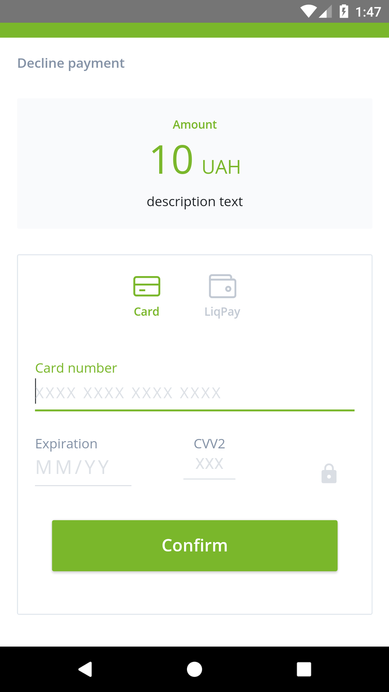
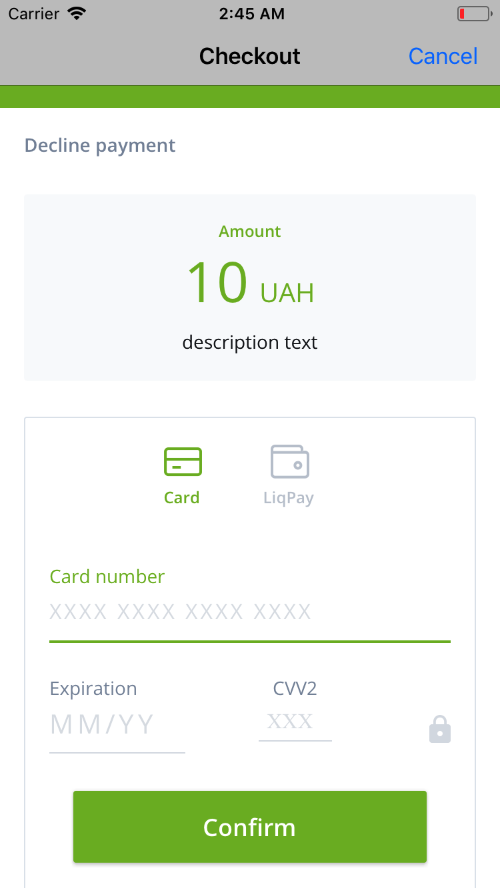

# react-native-liqpay

## Getting started

`$ npm install react-native-liqpay --save`

### Mostly automatic installation

`$ react-native link react-native-liqpay`

### Manual installation

#### iOS

1. In XCode, in the project navigator, right click `Libraries` ➜ `Add Files to [your project's name]`
2. Go to `node_modules` ➜ `react-native-liqpay` and add `RNLiqpay.xcodeproj`
3. In XCode, in the project navigator, select your project. From `RNLiqpay.xcodeproj/Producs/`, add `libRNLiqpay.a` to your project's `Build Phases` ➜ `Link Binary With Libraries`
4. Run your project (`Cmd+R`)

#### Android

1. Open up `android/app/src/main/java/[...]/MainActivity.java`
    - Add `import com.reactlibrary.RNReactNativeLiqpayPackage;` to the imports at the top of the file
    - Add `new RNReactNativeLiqpayPackage()` to the list returned by the `getPackages()` method
2. Append the following lines to `android/settings.gradle`:

  ```java
  include ':react-native-liqpay'
  project(':react-native-liqpay').projectDir = new File(rootProject.projectDir, '../node_modules/react-native-liqpay/android')
  ```

3. Insert the following lines inside the dependencies block in `android/app/build.gradle`:

  ```java
  compile project(':react-native-liqpay')
  ```

4. Insert the following lines inside the dependencies block in `android/app/src/main/AndroidManifest.xml`:

  ```xml
  <uses-permission android:name="android.permission.ACCESS_NETWORK_STATE"/>
  <uses-permission android:name="android.permission.READ_PHONE_STATE"/>

  <activity android:name="ua.privatbank.paylibliqpay.CheckoutActivity"/>
  ```

5. Insert the following lines inside the dependencies block in `android/app/src/main/java/com/[yourappname]/MainApplication.java`:

  ```java
  return Arrays.<ReactPackage>asList(
    new RNLiqpayPackage()
  );
  ```

## Usage

### Checkout

 

Get the API keys here:
https://www.liqpay.ua/ru/admin/business

More info on the params:
https://www.liqpay.ua/documentation/data_signature

Info on LiPay Checkout:
https://www.liqpay.ua/documentation/api/aquiring/checkout/doc

Example checkout:

```jsx
import { LiqpayCheckout } from 'react-native-liqpay';
import { Button, View } from 'react-native';

class Checkout extends React.Component {
  state = {
    showCheckout: false,
  }

  renderCheckout() {
    return(
      <LiqpayCheckout
        signature="..."
        privateKey="..."
        params={{
          public_key: '...',
          action: 'pay', // Possible values: 'pay' - payment, 'hold' - blocking funds on the sender's account, 'subscribe' - regular payment, 'paydonate' - donation, auth - preauthorization of the card
          version: '3', // API version
          amount: '10',
          currency: 'UAH',
          description: 'description text',
          order_id: 'order_id_X', // The maximum length is 255 characters
          product_description: 'product_description',
          sandbox: '1', // for testing
        }}
        onLiqpaySuccess={res => {
          console.log(res);
        }}
        onLiqpayError={error => {
          console.error(error);
        }}
      />
    );
  }

  render() {
    return (
      <View>
        <Button title="Pay" onPress={() => this.showCheckout()} />
          {this.state.showCheckout && this.renderCheckout()}
      </View>
    );
  }
}
```

### LiqpayCheckoutBase64

_todo_

### LiqpayApi

_todo_

### LiqpayApiBase64

_todo_
